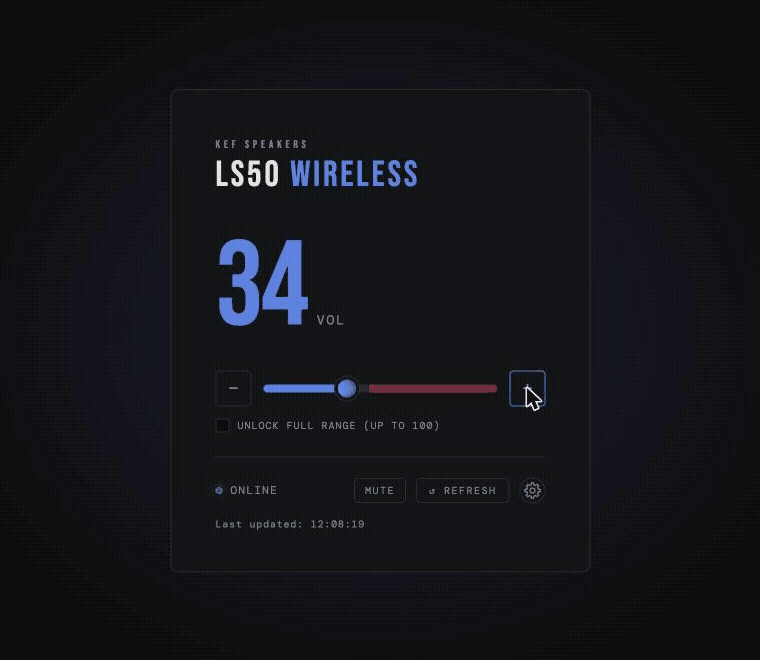
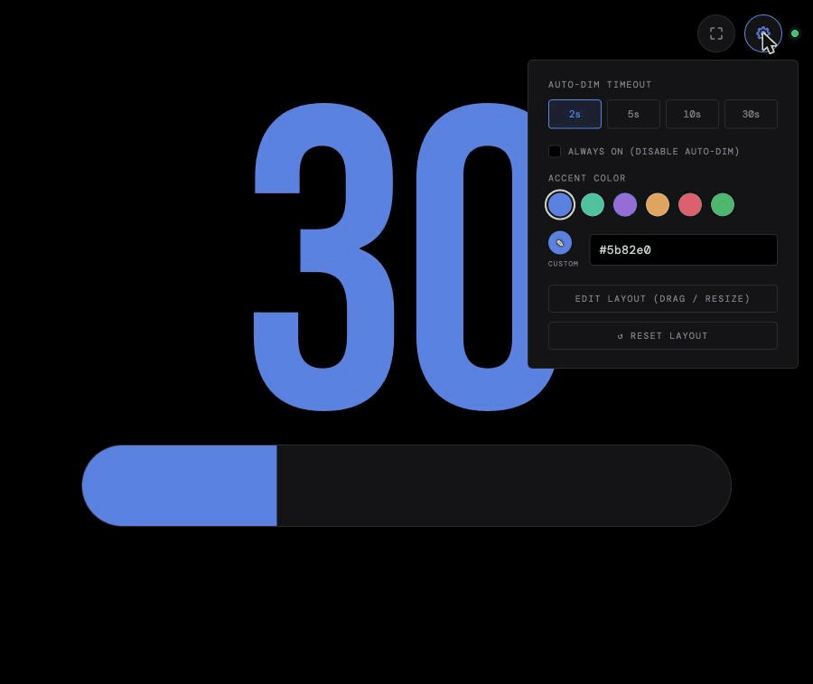

# KEF LS50 Wireless (Gen 1) Web-Based Volume Monitor

## Intro + Goal
This idea started with the occasional need to see the speaker's volume, without having to pick up the phone to check the KEF Control app. The goal: check and change the volume of first-generation KEF LS50 Wireless speakers from a website, without a remote in hand. While working out the infrastructure and architecture for that, I built two files: `kef_volume.html` and `kef_display.html`. Both can be opened on any device on the network, with `kef_display.html` for monitoring the volume and `kef_volume.html` for controlling it. They can be loaded on an old phone and used as a dedicated volume monitor/controller.

## Demo

`kef_volume.html`, the controller: step volume with +/− or drag the slider, unlock the full 0–100 range past the default safe ceiling, and pick an accent color.

`kef_display.html`, the read-only wall display: accent color theming, and drag/resize layout editing on both the numeral and the volume bar, rotate/remove/restore for the bar widget. TV-OSD-style fade after a short idle timeout, configurable.

See [FEATURES.md](FEATURES.md) for a full feature list, [ARCHITECTURE.md](ARCHITECTURE.md) for how it works, and [SETUP.md](SETUP.md) to run your own instance.

## Known Limitations

**Speakers cannot be turned on remotely over the network on early units.** This is a hardware/firmware limitation, not a bug in this project: once switched off, every port the speakers normally respond on (control port 50001, embedded web UI, UPnP) goes completely unreachable rather than staying in a low-power listening state, so no command can reach a powered-down unit. Waking requires physically pressing the power button. Per KEF's [firmware release notes](https://assets.kef.com/pdf_doc/ls50w/LS50-Wireless-Firmware-Release-Note.pdf), network wake-up is only supported on units with a serial number at or after `LS50W13074K24L/R2G` (printed on the back, format `LS50Wnnnnn...`). Earlier pairs lack it entirely. While an affected pair is off, the dashboard can only report "offline" (last known volume shown dimmed, controls disabled); it can't bring them back online.

**`kef_display.html`'s screen-wake-lock hack that only works in Firefox.** The real Screen Wake Lock API needs HTTPS, which this project deliberately avoids (see [SETUP.md](SETUP.md), plain HTTP by design). The workaround plays a video with audio, relying on the phone's media volume being turned down so it's inaudible to the user, since Firefox for Android only exempts a tab from screen-timeout if it's genuinely producing audio, muted/silent video gets no exemption, and the check is "is this tab producing audio," so keeping the phone's own media volume down doesn't break the exemption (it just keeps things quiet). If media volume gets turned up, you'll hear it, so volume-down is a requirement, not just a suggestion. Chrome for Android has no equivalent trick at all, so on Chrome the phone just follows the OS screen-timeout, same as normal use. Tested only on Android (Firefox and Chrome); untested on iPhone.

## Acknowledgements
This project wouldn't have been possible without [`aiokef`](https://github.com/basnijholt/aiokef), which reverse-engineered the LS50 Wireless's undocumented TCP control protocol in the first place. The raw command bytes used by `kef_server.py` are read directly from its source.

## License
[PolyForm Noncommercial 1.0.0](LICENSE), free for personal, hobby, educational, and nonprofit use; commercial use is not permitted.
